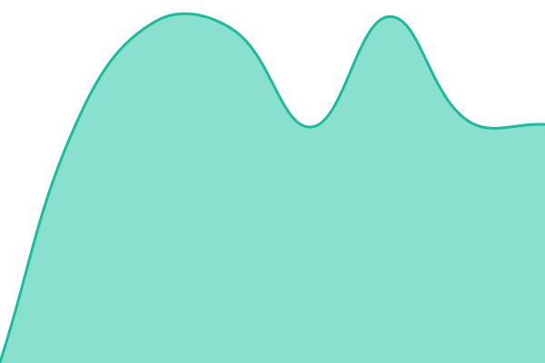
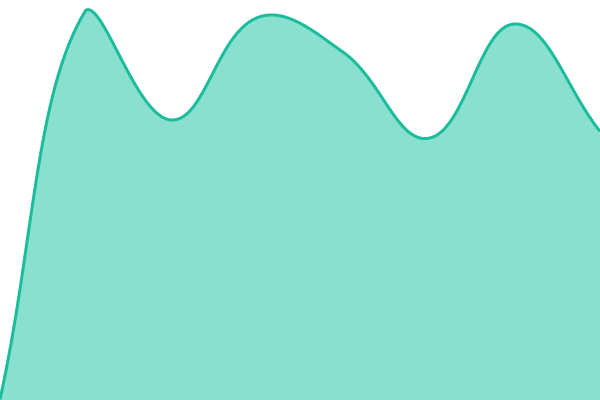
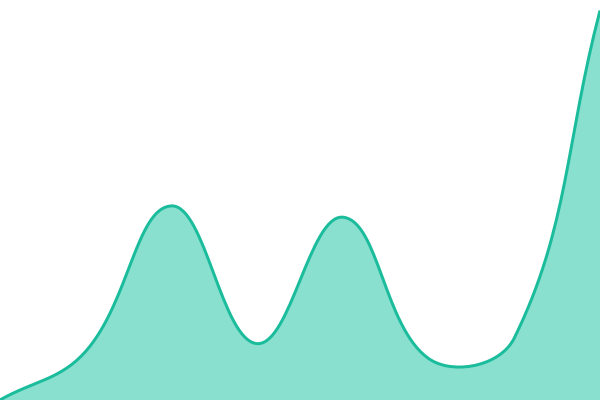

# [📈 Live Status](https://aweiand.github.io/puzzle-status): <!--live status--> **🟩 All systems operational**

This repository contains the open-source uptime monitor and status page for [Augusto Weiand](http://www.sitches.com.br), powered by [Upptime](https://github.com/upptime/upptime).

With [Upptime](https://upptime.js.org), you can get your own unlimited and free uptime monitor and status page, powered entirely by a GitHub repository. We use [Issues](https://github.com/aweiand/puzzle-status/issues) as incident reports, [Actions](https://github.com/aweiand/puzzle-status/actions) as uptime monitors, and [Pages](https://aweiand.github.io/puzzle-status) for the status page.

<!--start: status pages-->
<!-- This summary is generated by Upptime (https://github.com/upptime/upptime) -->
<!-- Do not edit this manually, your changes will be overwritten -->
<!-- prettier-ignore -->
| URL | Status | History | Response Time | Uptime |
| --- | ------ | ------- | ------------- | ------ |
|  [Puzzle API](https://api.puzzle.techtd.com.br/alive) | 🟩 Up | [puzzle-api.yml](https://github.com/aweiand/puzzle-status/commits/HEAD/history/puzzle-api.yml) | 

 594ms
     
 | 

<a href="https://aweiand.github.io/puzzle-status/history/puzzle-api">98.67%</a>
    

|  [Puzzle MicroGen](https://micro.puzzle.techtd.com.br/alive) | 🟩 Up | [puzzle-micro-gen.yml](https://github.com/aweiand/puzzle-status/commits/HEAD/history/puzzle-micro-gen.yml) | 

 581ms
     
 | 

<a href="https://aweiand.github.io/puzzle-status/history/puzzle-micro-gen">98.72%</a>
    

|  [Puzzle Operation](https://todotrade-puzzle-op.techtd.com.br) | 🟩 Up | [puzzle-operation.yml](https://github.com/aweiand/puzzle-status/commits/HEAD/history/puzzle-operation.yml) | 

 1878ms
     
 | 

<a href="https://aweiand.github.io/puzzle-status/history/puzzle-operation">98.77%</a>
    

|  [Puzzle Plan](https://todotrade-puzzle-plan.techtd.com.br) | 🟩 Up | [puzzle-plan.yml](https://github.com/aweiand/puzzle-status/commits/HEAD/history/puzzle-plan.yml) | 

 1962ms
     
 | 

<a href="https://aweiand.github.io/puzzle-status/history/puzzle-plan">98.82%</a>
    

<!--end: status pages-->

[**Visit our status website →**](https://aweiand.github.io/puzzle-status)

## 📄 License

- Powered by: [Upptime](https://github.com/upptime/upptime)
- Code: [MIT](./LICENSE) © [Anand Chowdhary](https://anandchowdhary.com), supported by [Pabio](https://pabio.com)
- Data in the `./history` directory: [Open Database License](https://opendatacommons.org/licenses/odbl/1-0/)
